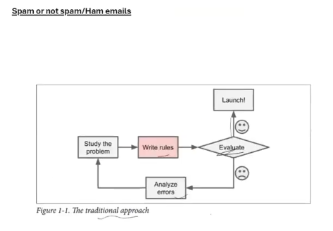
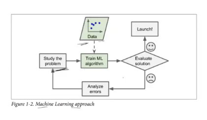
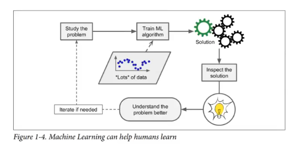
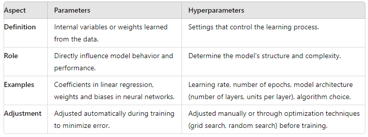

<h1>Lecture 2</h1> 

<h3>Application of Machine learning</h3>

 Detect Spam Emails

<h4>Tradtional Approach to detect Spam Email</h4>

<h4>Machine Learning Approach</h4>

Applying machine learning techniques to analyze large datasets can uncover hidden patterns, which is the essence of data mining. In spam email detection, data mining techniques can be used to identify patterns and characteristics common in spam emails, such as specific keywords, unusual sender addresses, and common phrases. By training a machine learning model on a labeled dataset of emails (spam and non-spam), the model can learn to classify new emails based on these patterns, effectively filtering out spam with high accuracy. 

<h4>Additional Terms</h4>

<h6> ML Model </h6>

A machine learning model is a mathematical algorithm or computational model that learns patterns from data to make predictions or decisions without being explicitly programmed to do so.

Here's a comparison of parameters and hyperparameters in the form of a table

